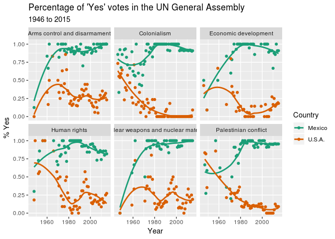

main\_code
================
David Cobb
1/15/2019

Load Libraries
--------------

Insert a code chunk to load the `tidyverse`, `unvotes`, and `lubridate` packages. Use the `knitr` option `include = FALSE`.

Why can't I get this to work? {r libs, include=FALSE} knitr::opts\_chunk$set(echo = TRUE)

Plot the Data
-------------

Choose a country in the data set and replicate what we did in class by substituting that country for Australia. Knit the document so that a new `github-intro.md` file is created, add it to the repo, commit it, and push it to github.

``` r
library(tidyverse)
```

    ## ── Attaching packages ───────────────────────────────────────────── tidyverse 1.2.1 ──

    ## ✔ ggplot2 3.0.0     ✔ purrr   0.2.5
    ## ✔ tibble  1.4.2     ✔ dplyr   0.7.6
    ## ✔ tidyr   0.8.1     ✔ stringr 1.3.1
    ## ✔ readr   1.1.1     ✔ forcats 0.3.0

    ## ── Conflicts ──────────────────────────────────────────────── tidyverse_conflicts() ──
    ## ✖ dplyr::filter() masks stats::filter()
    ## ✖ dplyr::lag()    masks stats::lag()

``` r
library(unvotes)
```

    ## If you use data from the unvotes package, please cite the following:
    ## 
    ## Erik Voeten "Data and Analyses of Voting in the UN General Assembly" Routledge Handbook of International Organization, edited by Bob Reinalda (published May 27, 2013)

``` r
library(lubridate)
```

    ## 
    ## Attaching package: 'lubridate'

    ## The following object is masked from 'package:base':
    ## 
    ##     date

``` r
## Data Manipulation
un_votes_joined <- un_votes %>%
  filter(country %in% c("United States of America", "Mexico")) %>%
  inner_join(un_roll_calls, by = "rcid") %>%
  inner_join(un_roll_call_issues, by = "rcid") %>%
  group_by(country, year = year(date), issue) %>%
  summarize(
    votes = n(),
    percent_yes = mean(vote == "yes")
  ) %>%
  filter(votes > 5) # only use records where there are more than 5 votes
```

    ## Warning: Column `rcid` has different attributes on LHS and RHS of join

    ## Warning: Column `rcid` has different attributes on LHS and RHS of join

``` r
## Make Plots

p <- ggplot(un_votes_joined,
            aes(x = year, y = percent_yes, color = country))
p + geom_point() +
  geom_smooth(method = "loess", se = FALSE) +
  facet_wrap(~ issue) +
  scale_color_brewer(palette = "Dark2", labels = c("Mexico", "U.S.A.")) +
  labs(
    title = "Percentage of 'Yes' votes in the UN General Assembly",
    subtitle = "1946 to 2015",
    y = "% Yes",
    x = "Year",
    color = "Country"
  )
```


